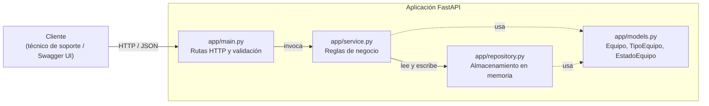
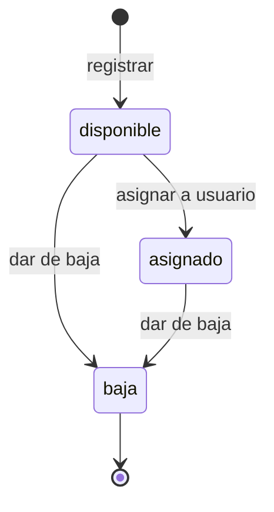

# Arquitectura de Inventario TI

## Diagrama de componentes

```mermaid
flowchart LR
    cliente["Cliente<br/>(técnico de soporte / Swagger UI)"]

    subgraph api["Aplicación FastAPI"]
        main["app/main.py<br/>Rutas HTTP y validación"]
        service["app/service.py<br/>Reglas de negocio"]
        repo["app/repository.py<br/>Almacenamiento en memoria"]
        models["app/models.py<br/>Equipo, TipoEquipo, EstadoEquipo"]
    end

    cliente -->|"HTTP / JSON"| main
    main -->|"invoca"| service
    service -->|"lee y escribe"| repo
    service -.->|"usa"| models
    repo -.->|"usa"| models
```

## Diagrama de estados de un equipo

```mermaid
stateDiagram-v2
    [*] --> disponible: registrar
    disponible --> asignado: asignar a usuario
    disponible --> baja: dar de baja
    asignado --> baja: dar de baja
    baja --> [*]
```